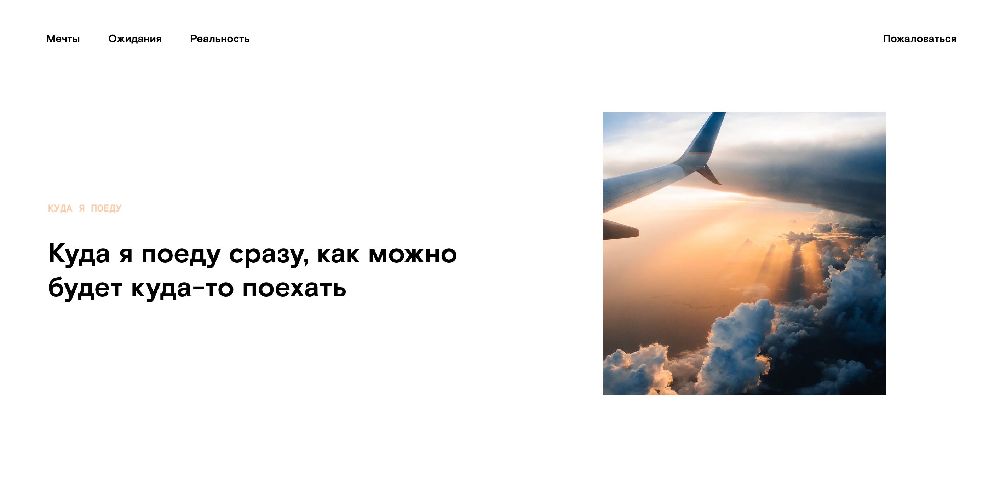

<h1 align="center">Куда я поеду</h1>

---

Проект о путешествии по Миру расскажет вам
о самых разных краях нашей планеты. Вы сможете увидеть
величественные пейзажи живописной природы.

<h2>Работа выполнена с использованием технологий:</h2>
<ul>
  <li>
HTML
</li>
  <li>
CSS
</li>
  <li>
JavaScript
</li>
  <li>
Flexbox Layout
</li>
  <li>
Grid Layout
</li>
  <li>
Проект сделан по принципам объектно-ориентированного программирования
</li>
</ul>

________________________________

# Cсылка gh - https://ilkor4.github.io/kuda-ya-poedy/

<h2>Над проектом работал:</h2>
<h3><a href="https://github.com/ilkor4" target="_blank">Il.kor</a></h3># Проект: Куда я поеду

